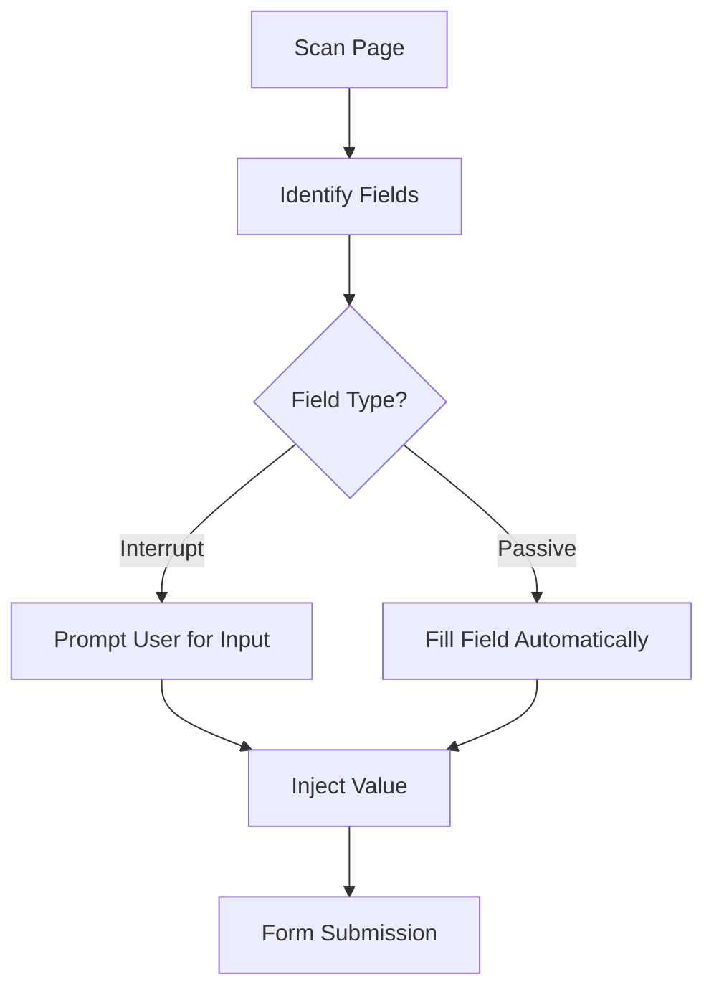

# Interruptible Smart Autofill System

## Description

A user-controlled autofill tool for browser-based forms that integrates runtime user prompts, enabling intelligent form filling with per-field intervention. By adapting `arthurbabin/ai-form-filler`, this project introduces reactive logic that detects label text on survey forms and pauses execution to request manual input from the user before completing the field. It combines autofill precision with human judgment, particularly for contexts where fields cannot be programmatically filled without semantic awareness.

## Functionality

### Core Features (`model.py`)

- Scan form fields and associated labels using DOM traversal and heuristics.
- Determine whether a field qualifies for manual injection based on label keywords (e.g. survey questions).
- For qualifying fields:
  - Trigger runtime `prompt()` or overlay input UI to allow user to type content.
  - Store and reuse responses when relevant (optional).
- For non-interactive fields (e.g. dates, names):
  - Autofill using preconfigured or AI-generated values.
- Provide toggles for autofill modes: "Passive", "Interactive", "Full Manual".
- Include debug/preview mode to test which fields are detected and what behavior is applied.

### User Interface (`main.py`)

Under default PySide6 settings:

- A main window titled "Smart Autofill Manager" with:
  - **Field Preview Pane**: Tree or list view showing detected fields and their labels.
  - **Mode Selector**: Dropdown with autofill modes ("Passive", "Interactive", "Manual").
  - **Response Cache Manager**: Table view showing saved responses per label.
  - **Trigger Panel**:
    - Button: "Scan Current Page"
    - Button: "Begin Autofill"
  - **Runtime Input Dialog**: When triggered during interrupt mode, displays the label text and a text box for manual response entry.

Layouts can use `QVBoxLayout` for stacking sections and `QFormLayout` for response editing.

## Technical Implementation

### Architecture

The application is split into two main components:
- `model.py`: Contains all the application logic, data handling, and state management. It is decoupled from the UI.
- `main.py`: Implements the user interface using PySide6 and handles user interactions, signaling the model to perform actions.

### Data Structures (`model.py`)

```json
{
  "field": {
    "id": "input_1",
    "type": "text",
    "label": "What is your opinion on X?",
    "autofill_mode": "interrupt",
    "value": null
  },
  "runtimePromptQueue": [
    {
      "fieldId": "input_1",
      "labelText": "What is your opinion on X?"
    }
  ],
  "profiles": {
    "default": {
      "fullName": "John Doe",
      "email": "john@example.com"
    }
  }
}
```

### User Interaction and Event Handling

- When user clicks "Scan Page":
  - `model.py` scans DOM, generates field list.
  - List is sent to UI (`main.py`) for preview.
- On "Begin Autofill":
  - Loop begins in `model.py`; each field processed:
    - If field is interrupt mode:
      - Signal sent to `main.py` to invoke runtime dialog.
      - Response captured and passed back to `model.py`.
    - If field is passive mode:
      - Autofill proceeds silently.
- Updates reflected live in the Field Preview Pane.

### Input and Output Specifications

**Input**:
- Browser DOM (via content script or automation).
- User-entered manual responses (via UI).
- Predefined profiles.

**Output**:
- Filled form fields in the browser.
- Optional export of autofill logs or session data (JSON or text format).
- Debug output visible in Field Preview Pane.

### Dependencies and Third-Party Integrations

- `PySide6 >= 6.9.0` (GUI)
- `requests` (if using external AI APIs)
- Optional:
  - `ollama` or `openai` module (if adapting AI field logic)
  - `selenium` or `pyppeteer` (for browser automation fallback)
- Uses source logic from `arthurbabin/ai-form-filler`

### Error Handling and Validation

- Invalid field targets: Show visual cue in UI and skip field.
- User cancels runtime prompt: Log and skip field.
- DOM query failures: Log warning; continue execution.
- Input validation (e.g., required fields): Alert user after scan with warnings.
- API errors (if used): Present retry option with message.

### Technical Constraints and Non-Functional Requirements

- Must execute efficiently in real-time, avoiding excessive delays on large forms.
- Local execution preferred; avoid cloud dependencies unless optional.
- Designed to be extensible—new field types or prompt behaviors can be added via config.
- Interface should remain responsive during form scan and injection.

## Acceptance Criteria

- Fields matching interrupt criteria must pause and allow live input.
- Passive fields should autofill based on profile data without user intervention.
- Preview pane must correctly reflect current status of each detected field.
- UI must support live interaction without freezing or lag.
- Profiles and responses should persist between sessions (optional).

## Visual Aids

Here’s a simple conceptual layout using Mermaid syntax:



UI layout sketch (textual):

- Top: Mode Selector
- Left Pane: Field Preview
- Center Pane: Runtime Dialog
- Bottom: Start/Scan Buttons
